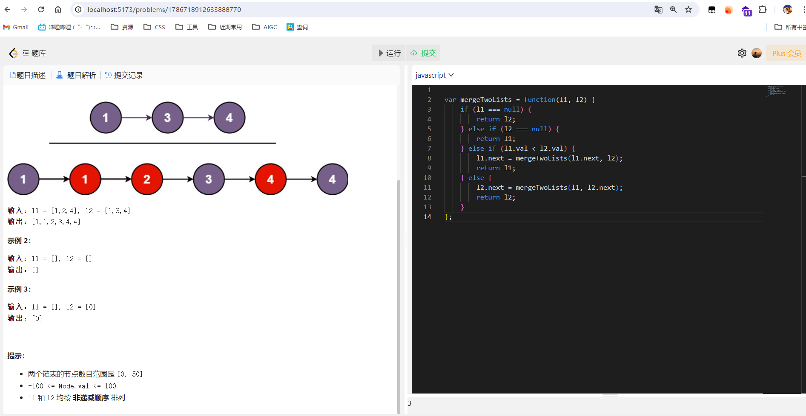
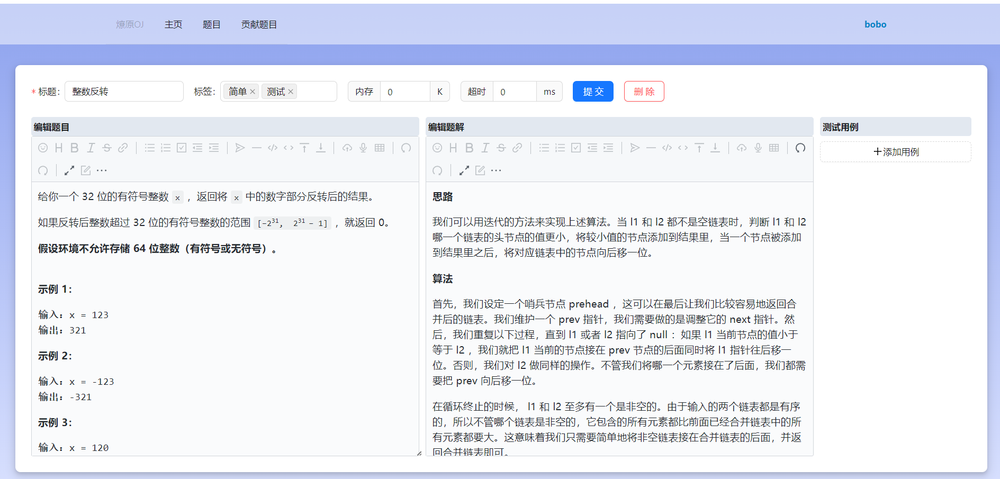

## OJ 做题平台

**项目介绍**  

对标各大学校的OJ平台，支持以下功能：

- 贡献题目（编辑题目上传）
- 题目标签分类，检索
- 题目数据分析（通过数，提交数）
- 在线运行代码（**支持 java, typescript**）
- 提交代码，查看结果以及提交历史
- 管理员修改，删除题目

目前正在迭代开发中，新功能陆续开发

**技术栈**

前端框架： Vue3 (3.4+)， pinia
UI框架：ant-design, Tailwind css
语言： TypeScript
编辑器插件： vditor，monaco

**运行截图**

做题界面，仿力扣，支持拖拽改变编辑器的宽度和高度

编辑题目界面：

